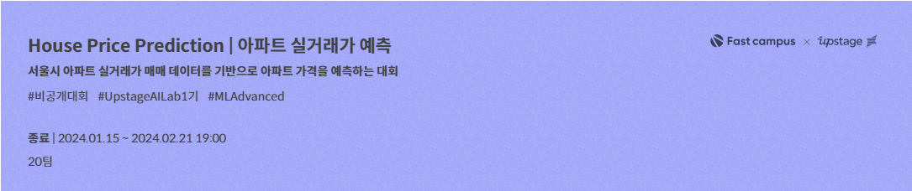
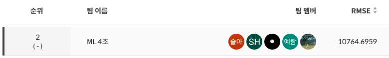

# House Price Prediction | 아파트 실거래가 예측


[](https://hits.seeyoufarm.com)
 <br>
프로젝트 기간: `Jan 15, 2024 ~ Jan 25, 2024`

## 목차
 - [Competetion Info](#1-competetion-info)
 - [Directory](#2-directory)
 - [Feature Engineering](#3-feature-engineering)
 - [Modeling](#4-modeling)
 - [Result](#5-result)

## 0. Environment
- CUDA Version 12.2 
- NVIDIA GeForce RTX 3090

## 1. Competetion Info

주최: Upstage + Fastcampus on Aistages <br>

|  |  |
|------------------------------------------------------------------|------------------------------------------------------------------|
| Fastcampus                                                       | Upstage                                                        |

### 1-1. Team

| |  |  
| :--------------------------------------------------------------: | :--------------------------------------------------------------: | :--------------------------------------------------------------: | 
|            [김영천](https://github.com/dudcjs2779)             |            [배창현](https://github.com/Bae-ChangHyun)             |                    [조예람](https://github.com/huB-ram)             |      

### 1-2 Overview

House Price Prediction 경진대회는 주어진 데이터를 활용하여 서울의 아파트 실거래가를 예측.

부동산 실거래가의 예측은 시세를 예측하여 적정한 가격에 구매와 판매를 도와주며, 정부는 비정상적으로 시세가 이상한 부분을 파악하거나, 업거래 다운거래 등 부정한 거래를 하는 사람들을 포착할 수 있다.

이를 위해 다양한 부동산 관련 의사결정을 돕는 부동산 실거래가를 예측하는 모델을 개발하고자 하며 

특히, 가장 중요한 서울시로 한정해서 서울시의 아파트 가격을 예측하고자 한다.

### 1-3. Evaluation metric

$$ \text{RMSE} = \sqrt{\frac{1}{n} \sum_{i=1}^{n} (y_i - \hat{y}_i)^2} $$

## 2. Directory

```bash
├── data                    
│   ├── seoul_bus.csv
│   ├── seoul_subway.csv
│   ├── seoul_school.csv
│   ├── interest_rate.csv
│   ├── price_index.csv
│   ├── family_income.csv
│   └── train, test.csv
├── code
└──  └── main.ipynb
```

### 2-1. Data descrption

`Train data`
: (1118822,52) / 2007.01.01 ~ 2023.06.30 기간의 아파트 정보 및 실거래가 <br>
`Test data`
: (9272,51) / 2023.07.01 ~ 2023.09.26 기간의 아파트 정보 <br>
`seoul_bus.csv`
: (12584,6) / 서울의 버스 정류소번호, 정류소명, 경위도, 정류소 타입 <br>
`seoul_subway.csv`
: (768,5) / 서울 지하철 역사ID, 역사명, 호선, 경위도 <br>
`seoul_school.csv`
: (3932,28) / 서울 초.중.고등학교 세부정보 <br>
`price_index.csv`
: (201,2) / 2007.01 ~ 2023.06의 서울 아파트 실거래가격지수 <br>
`interest_rate.csv`
: (12,208) / 2007.01 ~ 2023.06의 기준금리<br>
`family_income.csv`
: (20,52)  / 권역별 소득

## 3. Feature Engineering
- GeoCoding을 이용한 주소 to 경위도 변환으로 외부 데이터 결합
- 외부 데이터를 이용한 결측치 처리
- 전용면적 범주화 
- 외부 데이터(금리,인접시설) 결합
- 동일 아파트, 전용면적에 해당하는 최근 거래가 추가
- target 로그 변환

## 4. Modeling
### 4-1. Model
`XGBoost`,`CatBoost`,`LGBM`, `RandomForest` 와 `Optuna`를 이용한 하이퍼파라미터 튜닝.

|  |  |  |  |
|:---:|:---:|:---:|:---:|
| XGBoost | CatBoost | LightGBM | Random Forest |


### 4-2. Validation
- test와 인접 기간 -> test와 인접한 최근 2023.01~2023.06을 validation set 구성
- k-fold -> k fold를 이용하여 5개의 fold를 나눠 validation set 구성
- Stratified k-fold: target을 구간화하여 train과 valid의 target분포가 유사하도록 fold를 나눠 validation set 구성

### 4-3. Train
- 전체 데이터를 이용한 학습
- 구별로 나눠 학습
- 전용면적 범주별로 나눠 학습
- 아파트별로 나눠 학습

### 4-4. Final
- 여러 실험결과 (LGBM + Optuna + 1월~6월 validation set + 전체 학습) 조합이 가장 좋은 성능을 보였음.

## 5. Result

### 5-1. Leader Board
- Final Rank:2nd
- Public Score:14760.6767(2nd)
- Private Score: 10764.6959(2nd)


### Reference
- [실거래가: 국토교통부](https://www.kiep.go.kr/menu.es?mid=a10602010000)
- [서울시 공공주택 아파트정보: 서울열린데이터광장](https://data.seoul.go.kr/dataList/OA-15818/S/1/datasetView.do)
- [서울시 가구총소득: 서울열린데이터광장](https://data.seoul.go.kr/dataList/DT201013B022/S/2/datasetView.do)
- [실거래지수: KOSIS국가통계포털](https://kosis.kr/statHtml/statHtml.do?orgId=408&tblId=DT_KAB_11672_S1)
- [서울시 학교정보: 서울열린데이터광장](https://data.seoul.go.kr/dataList/OA-20502/S/1/datasetView.do)
- [아파트 정보: K-apt 공동주택관리정보시스템](https://www.k-apt.go.kr/board/boardList.do?board_type=03)
- [금리: 한국은행경제통계시스템](https://ecos.bok.or.kr/#/)
- [서울시 지하철:Upstage](https://www.upstage.ai/)
- [서울시 버스:Upstage](https://www.upstage.ai/)
- [train,test data:Upstage](https://www.upstage.ai/)